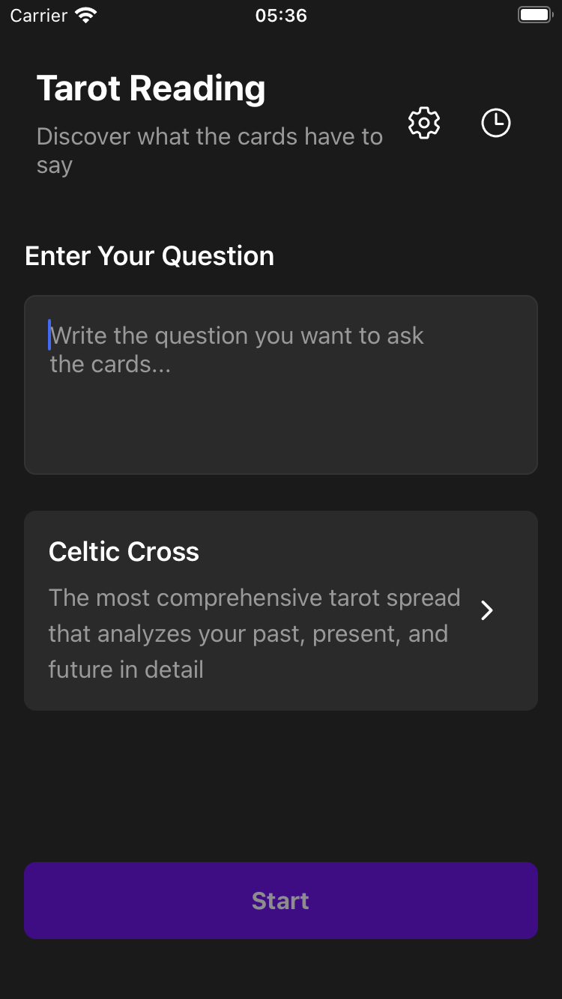
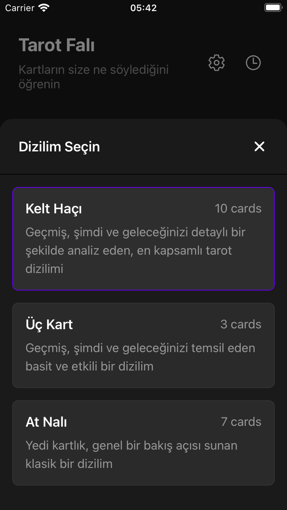
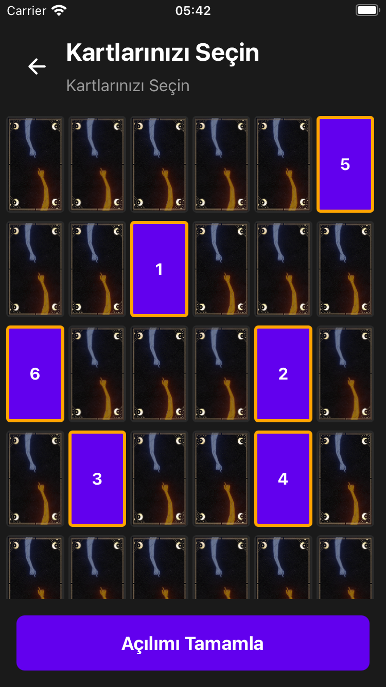
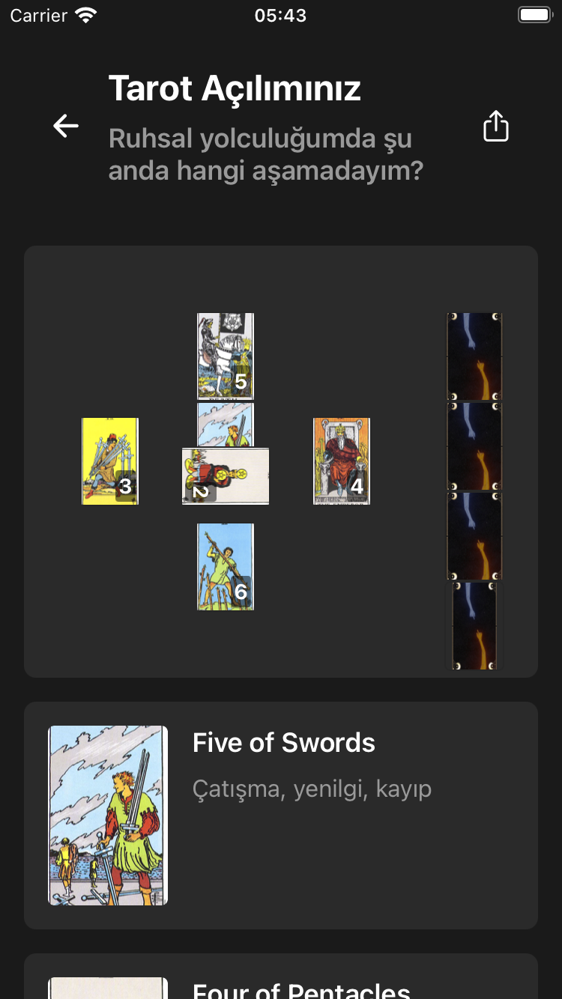
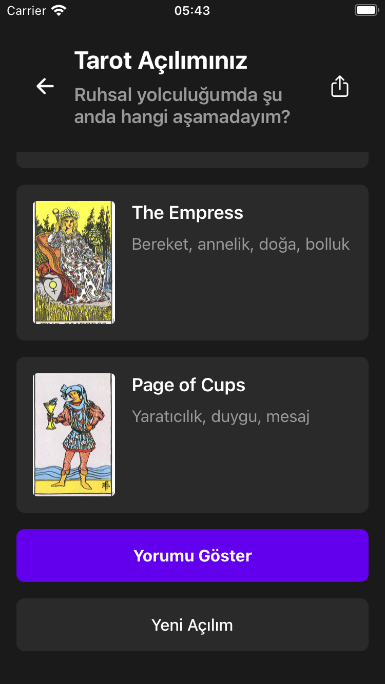
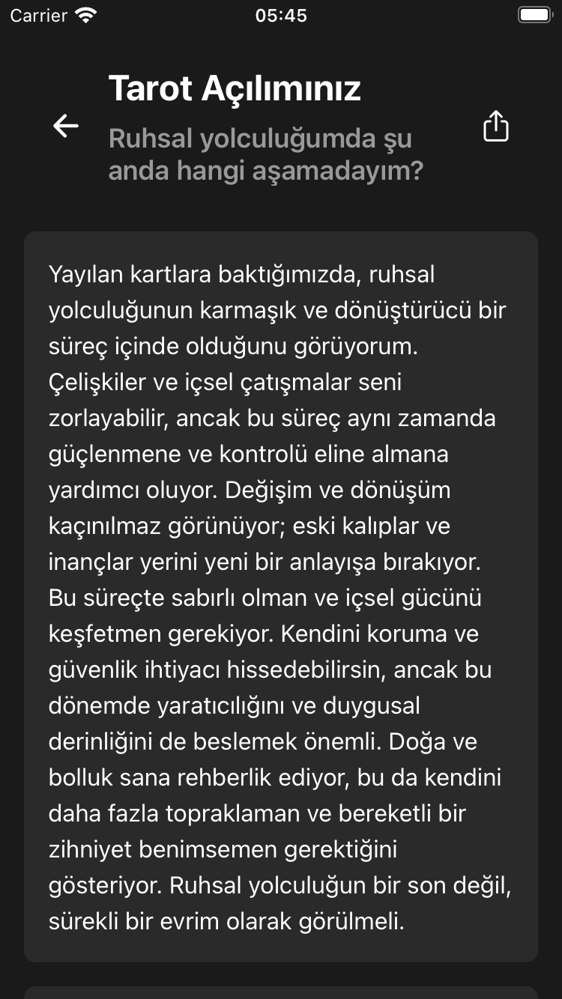
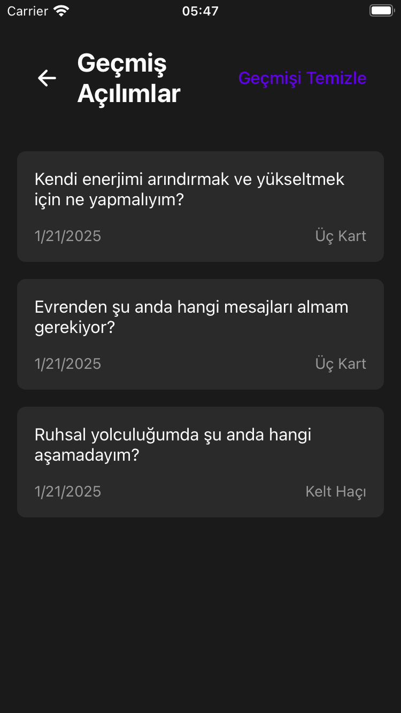
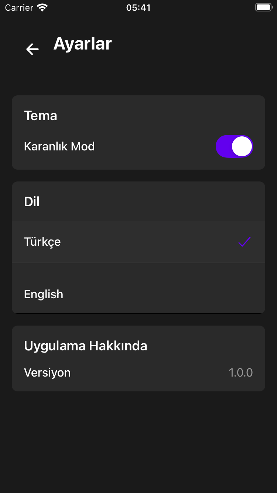
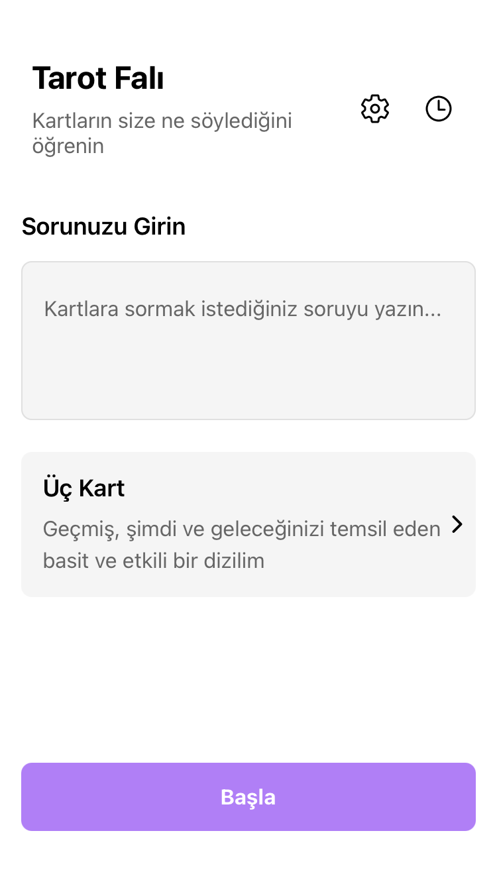

# 🔮 Tarot AI - Modern Tarot Deneyimi

Tarot AI, modern teknoloji ile geleneksel tarot okumasını birleştiren kapsamlı bir mobil uygulamadır. React Native ve Expo ile geliştirilmiş frontend ve NestJS backend yapısıyla, kullanıcılara kolay ulaşılabilir bir tarot deneyimi sunar.

## ✨ Özellikler

- 🎴 78 kartlık tam Tarot destesi
- 🔄 Çoklu tarot dizilimi seçenekleri (Kelt Haçı, Üç Kart, At Nalı)
- 🌍 Çoklu dil desteği (Türkçe, İngilizce)
- 🌓 Karanlık/Aydınlık tema desteği
- 💾 Yerel veri saklama ile okuma geçmişi
- 🤖 AI destekli tarot yorumları
- 📱 Cross-platform destek (iOS & Android)

## 🖼️ Ekran Görüntüleri

<div align="center">
  <div style="display: flex; flex-wrap: wrap; gap: 10px; justify-content: center;">
    
    
    
    
    
    
    
    
  </div>
  
  <div style="margin-top: 20px;">
    
  </div>
</div>

## 🛠️ Teknolojiler

### Mobile (Frontend)

- React Native & Expo
- TypeScript
- React Navigation
- Async Storage
- Axios
- React Native Reanimated

### API (Backend)

- NestJS
- TypeScript
- OpenAI & OpenRouter API Entegrasyonu
- RESTful API Mimarisi

## 🚀 Kurulum

### Mobil Uygulama

```bash
# Bağımlılıkları yükle
cd mobile
pnpm install

# Geliştirme sunucusunu başlat
pnpm start
```

### API

```bash
# Bağımlılıkları yükle
cd api
pnpm install

# Geliştirme sunucusunu başlat
pnpm run start:dev
```

## 📱 Uygulama Mimarisi

### Dizin Yapısı

```
mobile/
├── app/                # Expo Router sayfaları
├── components/         # Yeniden kullanılabilir bileşenler
├── constants/          # Sabit değerler ve yapılandırmalar
├── contexts/           # React Context'leri
├── types/              # TypeScript tipleri
└── assets/             # Görseller ve fontlar

api/
├── src/
│   ├── controllers/    # API endpoint controllerleri
│   ├── services/       # Servisler
│   └── types/          # Veri tipleri
```

## 🎯 Temel Özellikler

- **Çoklu Dizilim Desteği**: Kelt Haçı (10 kart), Üç Kart ve At Nalı (7 kart) dizilimleri
- **AI Destekli Yorumlar**: OpenAI API entegrasyonu ile kişiselleştirilmiş tarot yorumları
- **Çoklu Dil Desteği**: Tam Türkçe ve İngilizce dil desteği
- **Tema Desteği**: Sistem temasına uyumlu karanlık/aydınlık mod
- **Veri Kalıcılığı**: AsyncStorage ile yerel veri saklama
- **Animasyonlar**: React Native Reanimated ile akıcı kart animasyonları

## 🤝 Katkıda Bulunma

1. Bu repo'yu fork edin
2. Yeni bir feature branch oluşturun (`git checkout -b feature/amazing-feature`)
3. Değişikliklerinizi commit edin (`git commit -m 'feat: Add amazing feature'`)
4. Branch'inizi push edin (`git push origin feature/amazing-feature`)
5. Bir Pull Request oluşturun

## 📄 Lisans

Bu proje MIT lisansı altında lisanslanmıştır. Detaylar için [LICENSE](LICENSE) dosyasına bakın.

## 👨‍💻 Geliştirici

Selim Can Özdemir - [@zxselimcan](https://github.com/zxselimcan)

## 🙏 Teşekkürler

- [Expo](https://expo.dev) - React Native geliştirme platformu
- [NestJS](https://nestjs.com) - Backend framework
- [OpenAI](https://openai.com) - AI destekli yorumlar
- [OpenRouter](https://openrouter.ai) - AI destekli yorumlar

Uygulamanın verdiği cevaplar yalnızca eğlence amaçlıdır ve gerçeği yansıtmaz.
